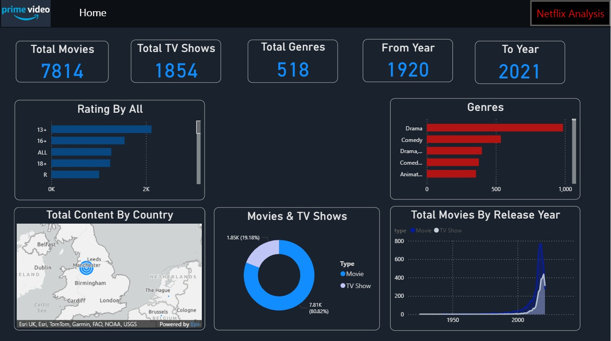
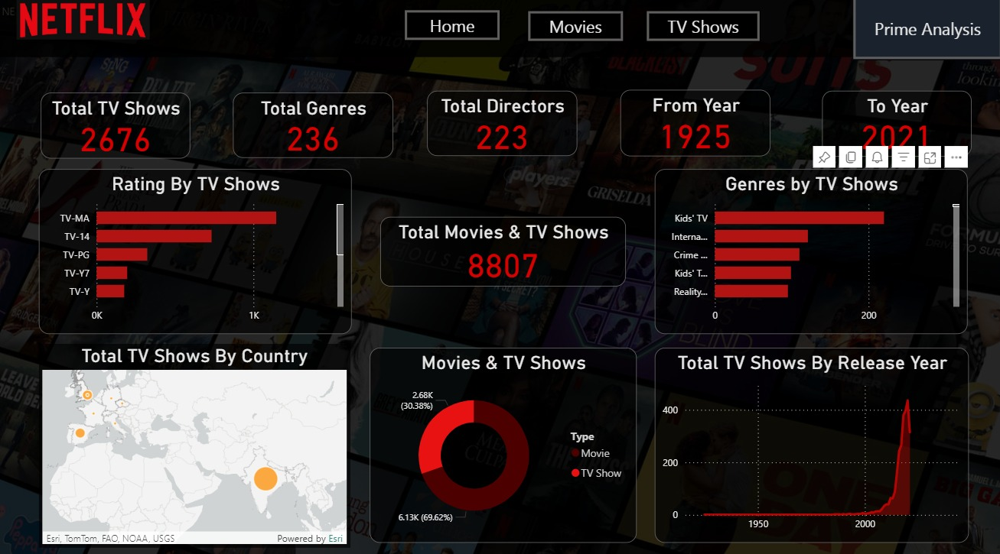
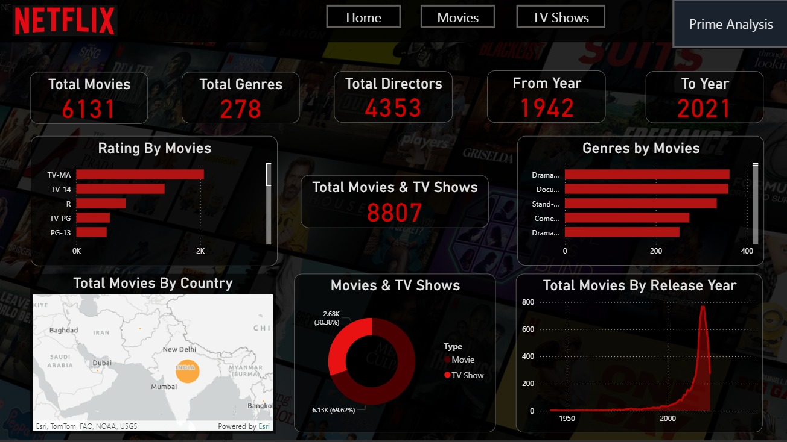
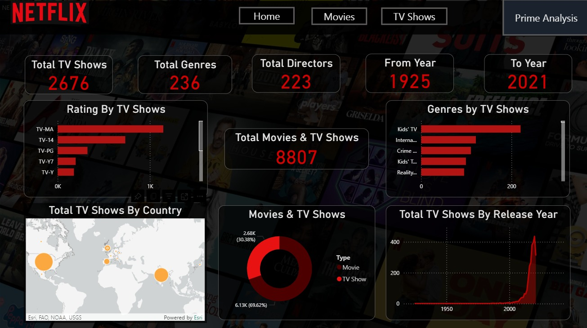

# Amazon-Prime-Netflix-Analysis
Power BI
## Project Description
The project analyzes streaming content from Netflix and Prime Video, focusing on movies and TV shows. It provides insights into the content library, ratings, trends over time, and key performance metrics.

## How to Use
1. Open the `Prime & Netflix Analysis.pbix` file in Power BI Desktop.
2. Use the **top navigation buttons** to switch between Movies and TV Shows pages.
3. Hover over charts to see detailed metrics and insights.

## Screenshots
| Prime - Overview | Netflix - Overview |
|-------------------|----------------------|
  |  

| Netflix - Movies | Netflix - TV Shows |
|-------------------|----------------------|
|  |  |
